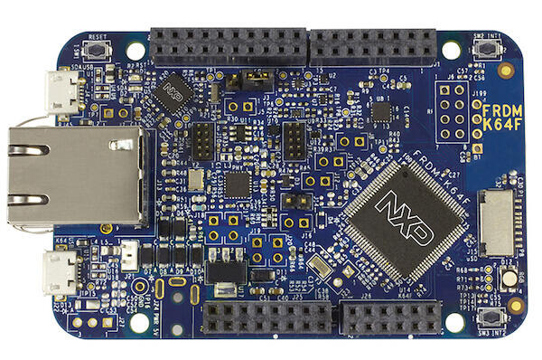

## What is OHW?

  OHW is defined as a fully open-source, non-commercial hardware wallet. What differentiates us from other products is that we have decided not to manufacture or produce proprietary hardware under our own brand.
  Our goal is to help everyone create their own hardware wallet and reliably manage their blockchain assets.

## Creating Your Own Hardware Wallet

  Your hardware wallet may not truly belong to you. Even products with good open-source practices often have many hidden restrictions preventing you from having customized firmware and hardware, and most users lack the capability to customize.

  Our firmware is completely open, and the hardware itself can utilize chips and development boards from most chip manufacturers currently available in the market. There are no hidden restrictions. We support 10+ chip manufacturers and 200+ SoCs.

  We use security-certified cryptographic libraries and chip-embedded security policies to protect users' assets.

  We employ cost-optimized development strategies, supporting chips with prices starting as low as $0.30.

## How to Use the Firmware

  We use Zephyr RTOS, which is a developer-friendly real-time operating system.

### Pre-compiled Firmware

  We provide pre-compiled firmware for development boards we own. Please check the Releases section on the right or see below for our available development boards. For direct use of pre-compiled firmware, please refer to...

### Self-compiled Firmware

  If your development board is not included in pre-compiled firmware, please check the following links to set up the development environment and compile firmware for your board.

  [https://docs.zephyrproject.org/latest/develop/getting_started/index.html](https://docs.zephyrproject.org/latest/develop/getting_started/index.html)

  Alternatively, you can try using Docker to simplify this process.

  [https://github.com/zephyrproject-rtos/docker-image](https://docs.zephyrproject.org/latest/develop/getting_started/index.html)

## Development Boards

  The development boards we own have Tier 1 level support, and developers will develop and test on these boards.

  Besides our owned boards, we also support 300+ other development boards. Please check the support list [Supported Boards and Shields](https://docs.zephyrproject.org/latest/boards/index.html).

|     Name     |                           ESP32-C3-DevKitM-1                           |             Raspberry Pi Pico             |               ESP32-S3-DevKitM-1🔥               |                   nRF52840-MDK                   |               NXP FRDM-K64F               |
| :----------: | :--------------------------------------------------------------------: | :---------------------------------------: | :-----------------------------------------------: | :-----------------------------------------------: | :---------------------------------------: |
|    Image    |  |  |  |  |  |
| Manufacturer |                               Espressif                               |               Raspberry Pi               |                     Espressif                     |               Nordic Semiconductor               |                    NXP                    |
|     Chip     |                              ESP32-C3FH4                              |                  RP2040                  |                     ESP32-S3                     |                     nRF52840                     |              MK64FN1M0VLL12              |
| Architecture |                                 RISC-V                                 |               Arm Cortex-M0               |              Xtensa (Tensilica LX7)              |                  ARM Cortex-M4F                  |               ARM Cortex-M4               |
|     RAM     |                                 400 KB                                 |                  264 KB                  |                   512 KB + 2 M                   |                      256 KB                      |                  256 KB                  |
|     ROM     |                              384 KB + 4 M                              |                16 KB + 2 M                |                   384 KB + 4 M                   |                        1 M                        |                    1M                    |
|    Price    |                                 \$1.5                                 |                    \$2                    |                          \$3                        |                       \$25                       |                   \$50                   |
