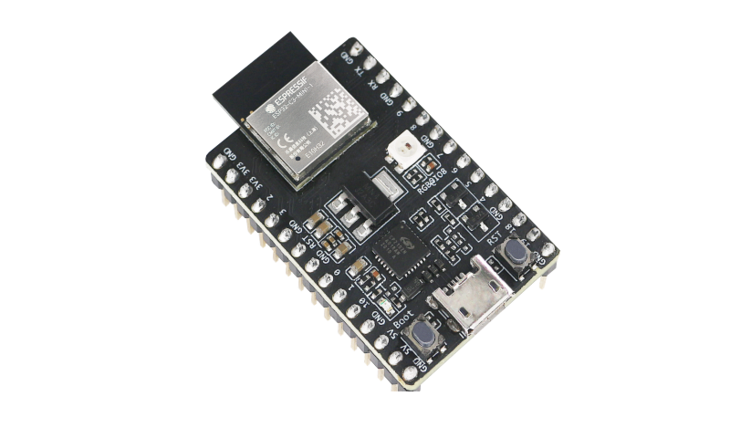

[中文点这里](./README_zh.md)

## What is OHW?

  OHW (Open Hardware Wallet) is a fully open-source, non-commercial hardware wallet project. What distinguishes us from other products is our decision not to manufacture or produce proprietary hardware under our own brand.

  Our goal is to help everyone create their own hardware wallet and reliably manage their assets.

## Creating Your Own Hardware Wallet

   Our mission is to help you create your own hardware wallet, both in terms of software and hardware. Therefore, we will not launch commercial hardware wallet products.

  You are free to choose any development board you prefer, whether it's open-source hardware like Arduino or Raspberry Pi, development boards from chip manufacturers, third-party vendor boards, or even design your own board.

  The Open Hardware Wallet supports multiple hardware architectures and is optimized for resource-constrained devices with security built-in from the ground up. The cheapest supported MCU costs only $0.3, with optional support for Bluetooth, WiFi, and display capabilities.

## How to Use the Firmware

### Pre-compiled Firmware

  We provide pre-compiled firmware for development boards we own. Please check the Releases section on the right or see below for our available development boards.

### Self-compiled Firmware

  If your development board is not included in pre-compiled firmware, please check the following links to set up the development environment and compile firmware for your board.

  [https://docs.zephyrproject.org/latest/develop/getting_started/index.html](https://docs.zephyrproject.org/latest/develop/getting_started/index.html)

  Alternatively, you can try using Docker to simplify this process.

  [https://github.com/zephyrproject-rtos/docker-image](https://docs.zephyrproject.org/latest/develop/getting_started/index.html)

  Note: Built with Rust for better safety. See setup guide at this.

  [https://www.rust-lang.org/tools/install](https://www.rust-lang.org/tools/install)

## Development Boards

  The development boards we own have Tier 1 level support, and developers will develop and test on these boards.

  Besides our owned boards, we also support 300+ other development boards. Please check the support list [Supported Boards and Shields](https://docs.zephyrproject.org/latest/boards/index.html).

  Due to the wide variety of development board models available, only the chip price is listed here. Please select your preferred development board.

|     Name     |                           ESP32-C3-DevKitM-1                           |             Raspberry Pi Pico             |                 Nucleo F401RE                 |                   nRF52840-MDK                   |               NXP FRDM-K64F               |
| :----------: | :--------------------------------------------------------------------: | :---------------------------------------: | :-------------------------------------------: | :-----------------------------------------------: | :---------------------------------------: |
|    Image    |  |  |  |  |  |
| Manufacturer |                               Espressif                               |               Raspberry Pi               |              STMicroelectronics              |               Nordic Semiconductor               |                    NXP                    |
|     Chip     |                              ESP32-C3FH4                              |                  RP2040                  |                 STM32F401RET6                 |                     nRF52840                     |              MK64FN1M0VLL12              |
| Architecture |                                 RISC-V                                 |               Arm Cortex-M0               |                 ARM Cortex-M4                 |                   ARM Cortex-M4                   |               ARM Cortex-M4               |
|     RAM     |                                 400 KB                                 |                  264 KB                  |                     96 KB                     |                      256 KB                      |                  256 KB                  |
|     ROM     |                              384 KB + 4 M                              |                16 KB + 2 M                |                    512 KB                    |                        1 M                        |                    1 M                    |
|  MCU Price  |                                 \$0.5                                 |                   \$0.8                   |                      \$2                      |                        \$3                        |                   \$20                   |
