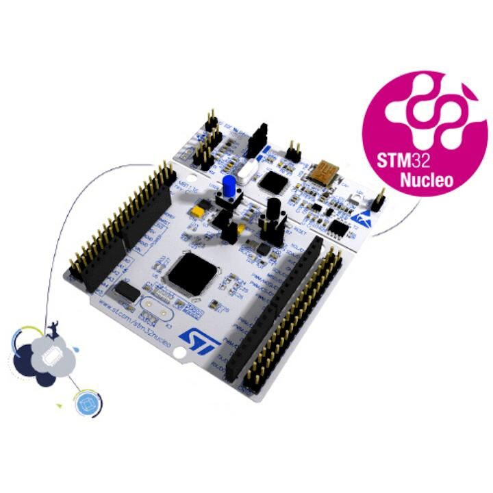

## OHW 是什么？

OHW 定义是一个完全开源的非商业产品的硬件钱包。我们的使命是帮助您创造自己的硬件钱包，无论是软件还是硬件。

与使用开源来推动其商业产品销售的商业硬件产品不同，我们的开源重点是构建基础设施。我们不限制特定的芯片制造商或型号。用户可以自由选择来自 10 多家制造商的 200 多种芯片，并可以使用芯片制造商或第三方制造的 3000 多种开发板，比如可以选择 Arduino 或 Raspberry Pi 等产品。

用户还可以根据我们即将发布的参考设计创建自己的开发板。

OHW 支持多种硬件架构，针对资源受限设备进行了优化，并在最开始设计时就考虑安全性。支持的最便宜的 MCU 价格仅为 0.3 美元，其他还有可选的支持蓝牙和 WiFi 还有屏幕。

## OHW 可以做什么?

我们构建了区块链和芯片的连接器，这不仅仅是一个硬件钱包。

### 功能:

#### ✅ 芯片内助记词生成和导入

[BIP39](https://github.com/bitcoin/bips/blob/master/bip-0039.mediawiki) 完成所有 [unit tests](https://github.com/butterfly-communtiy/ohw-lib-wallets/blob/main/src/mnemonic.rs).

#### ✅ HD (Hierarchical Deterministic) 分层确定性钱包.

[BIP32](https://github.com/bitcoin/bips/blob/master/bip-0032.mediawiki) 完成所有 [unit tests](https://github.com/butterfly-communtiy/ohw-lib-wallets/blob/main/src/wallets.rs).

#### ✅ secp256k1.

公私钥, 签名和 [unit tests](https://github.com/butterfly-communtiy/ohw-lib-wallets/blob/main/src/alg/crypto.rs).

#### 🚧 WebBrowser 支持

目前可以支持初始化、获取地址、签名通过串口在浏览器上操作，需要帮助进行下一步开发。

#### 🚧 WebUsb WiFi Bluetooth 支持.

需要帮助

#### 🚧 屏幕支持.

需要帮助

#### 演示视频:

## 如何使用固件

### 预编译固件

  我们会为我们拥有的开发板预编译固件，请查看右侧 Release 下载或者下文查看我们拥有哪些开发板。

### 自编译固件

  如果开发板不在预编译固件中，请查看以下链接设置开发环境，为开发板编译固件。

  [https://docs.zephyrproject.org/latest/develop/getting_started/index.html](https://docs.zephyrproject.org/latest/develop/getting_started/index.html)

  也可以选择尝试使用 Docker 简化这个过程。

  [https://github.com/zephyrproject-rtos/docker-image](https://docs.zephyrproject.org/latest/develop/getting_started/index.html)

  额外需要注意的是我们使用 Rust 这个更安全更现代的语言完成钱包功能，所以需要额外设置 Rust 编译环境。请参考以下链接。

  [https://www.rust-lang.org/tools/install](https://www.rust-lang.org/tools/install)

  [https://github.com/zephyrproject-rtos/zephyr-lang-rust](https://github.com/zephyrproject-rtos/zephyr-lang-rust)

  [https://github.com/zephyrproject-rtos/zephyr-lang-rust/discussions/11#discussioncomment-10905800](https://github.com/zephyrproject-rtos/zephyr-lang-rust/discussions/11#discussioncomment-10905800)

## 开发板

我们特意选择了来自不同的 5 个芯片制造商的 3 种架构的开发板作为官方支持，以展示我们不受供应商锁定的能力。开发者会在这些开发板上开发测试。

除了我们拥有的开发板，也直接支持其他 300+ 款开发板，请查看支持列表 [Supported Boards and Shields](https://docs.zephyrproject.org/latest/boards/index.html)。

由于开发板型号太多，这里只写了芯片的价格。请自行选择喜欢的开发板。

|   名称   |                        ESP32-C3-DevKitM-1 🔥🔥                        |           Raspberry Pi Pico 🔥           |                 Nucleo F401RE                 |                   nRF52840-MDK                   |               NXP FRDM-K64F               |
| :------: | :--------------------------------------------------------------------: | :---------------------------------------: | :-------------------------------------------: | :-----------------------------------------------: | :---------------------------------------: |
|   图片   |  |  |  |  |  |
|   厂商   |                               Espressif                               |               Raspberry Pi               |              STMicroelectronics              |               Nordic Semiconductor               |                    NXP                    |
|   芯片   |                              ESP32-C3FH4                              |                  RP2040                  |                 STM32F401RET6                 |                     nRF52840                     |              MK64FN1M0VLL12              |
|   架构   |                                 RISC-V                                 |               Arm Cortex-M0               |                 ARM Cortex-M4                 |                   ARM Cortex-M4                   |               ARM Cortex-M4               |
|   RAM   |                                 400 KB                                 |                  264 KB                  |                     96 KB                     |                      256 KB                      |                  256 KB                  |
|   ROM   |                              384 KB + 4 M                              |                16 KB + 2 M                |                    512 KB                    |                        1 M                        |                    1 M                    |
| 芯片价格 |                                 \$0.5                                 |                   \$0.8                   |                      \$2                      |                        \$3                        |                   \$20                   |
